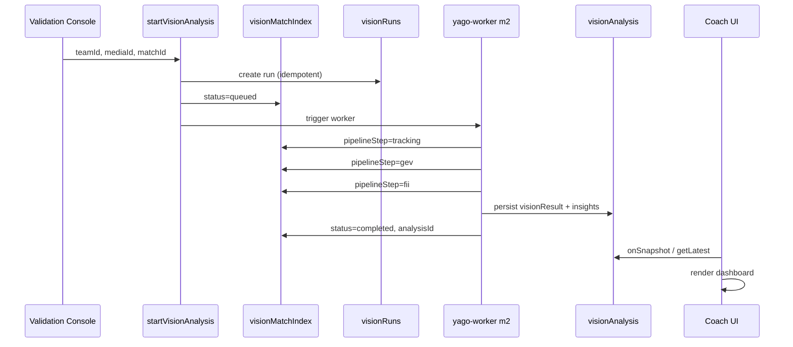

# YAGO Vision RC5-1 — Firestore Production Pipeline (Design)

**Date:** 2026-06-30  
**Status:** ✅ **IMPLEMENTED** — RC5-1 PASS (see `docs/YAGO_VISION_RC5_1_REPORT.md`)  
**Schema SoT:** `docs/YAGO_VISION_RC5_1_FIRESTORE_SCHEMA.md`  
**Parent:** `docs/YAGO_VISION_RC5_KICKOFF.md`  
**Gate:** RC5-1 Firestore Production Pipeline

> **구현 금지 (본 문서 단계):** GT · GEV Engine · FII Engine · Report Layer 수정 없음.

---

## 1. RC5-1 목표

실경기 영상 1건이 업로드되면 Firestore에 **분석 결과가 저장**되고, Coach/Parent UI가 **fixture 없이** 해당 문서를 읽을 수 있는 production 경로를 완성한다.

```text
Upload (media doc)
      │
      ▼
startVisionAnalysis (CF)
      │
      ▼
visionRuns + visionMatchIndex
      │
      ▼
Worker (m2 · rc3_1_phase_c)
      │
      ▼
visionAnalysis (matches/{matchId})
      │
      ▼
Coach / Parent UI (Firestore 우선)
```

---

## 2. 현재 상태 (RC4 Handoff)

### 이미 존재하는 자산

| 컴포넌트 | 경로 / 모듈 |
|----------|-------------|
| Match index | `teams/{teamId}/visionMatchIndex/{matchId}` |
| Vision runs | `teams/{teamId}/media/{mediaId}/visionRuns/{runId}` |
| Analysis | `teams/{teamId}/matches/{matchId}/visionAnalysis/{analysisId}` |
| CF callables | `functions/src/lib/academyVisionAnalysisCallables.ts` |
| CF persist | `functions/src/lib/academyVisionFirestore.ts` |
| Client status hook | `src/hooks/useMatchVisionPipelineStatus.ts` |
| Client analysis read | `src/lib/vision/visionFirestore.ts` |
| Upload entry | `/teams/:teamId/validation-console` |
| Worker CLI | `vision_engine_run.py --pipeline m2 --preset rc3_1_phase_c` |

### 알려진 갭

| Gap | 설명 |
|-----|------|
| firebase-admin hang | 로컬 inline script 24h+ abort (ops 트랙 분리) |
| FII in visionAnalysis | RC4는 `fii_summary` fixture; Firestore embed 스키마 정합 필요 |
| Granular progress | index `status`만 존재 — Tracking/GEV/FII 단계 미분리 |
| Parent read path | staff-only rules; parent-safe projection 정책 명시 필요 |
| Worker ↔ CF contract | m2 artifact → `normalizeVisionResultForFirestore` 매핑 검증 |

---

## 3. Firestore 데이터 모델

### 3.1 visionMatchIndex (match-scoped index)

**Path:** `teams/{teamId}/visionMatchIndex/{matchId}`

| Field | Type | 설명 |
|-------|------|------|
| `schemaVersion` | string | `yago-vision-run-v1` |
| `teamId` | string | |
| `matchId` | string | doc id |
| `mediaId` | string \| null | 업로드된 media |
| `runId` | string \| null | 활성/최근 run |
| `analysisId` | string \| null | 완료 시 visionAnalysis doc id |
| `status` | enum | `uploading` \| `queued` \| `processing` \| `completed` \| `failed` \| `cancelled` |
| `updatedAt` | timestamp | |

**RC5-1 확장 (제안):**

| Field | Type | 설명 |
|-------|------|------|
| `pipelineStep` | enum | `upload` \| `tracking` \| `gev` \| `fii` \| `persist` \| `done` |
| `pipelineStepLabel` | string | UI 표시용 (한국어) |
| `productionPreset` | string | `rc3_1_phase_c` (고정) |
| `errorCode` | string \| null | 실패 시 |
| `errorMessage` | string \| null | 사용자 노출용 (truncated) |

> `pipelineStep`은 RC5-3 Job Monitor와 공유. RC5-1에서는 **스키마만 확장** · CF write only.

### 3.2 visionRuns (media-scoped job)

**Path:** `teams/{teamId}/media/{mediaId}/visionRuns/{runId}`

기존 필드 유지 + RC5-1에서 검증할 항목:

| Field | 검증 |
|-------|------|
| `idempotencyKey` | `teamId:mediaId:matchId` |
| `status` | state machine 준수 |
| `matchId` | index doc id와 일치 |
| `startedFrom` | `manual` \| `auto` \| `retry` |
| `workerPayload` | tracking/gev 단계 메타 (optional) |

### 3.3 visionAnalysis (result SoT)

**Path:** `teams/{teamId}/matches/{matchId}/visionAnalysis/{analysisId}`

| Field | Type | 설명 |
|-------|------|------|
| `schemaVersion` | string | `yago-vision-analysis-firestore-v1` |
| `teamId` | string | |
| `matchId` | string | |
| `mediaId` | string | |
| `runId` | string | |
| `visionResult` | object | `yago-vision-result-v6-2` (normalized) |
| `visionResultSchemaVersion` | string | |
| `productionPreset` | string | `rc3_1_phase_c` |
| `fiiSummary` | object \| null | RC5-1: `fii_summary.json` subset embed (optional ref) |
| `coachInsights` | object | denormalized for read |
| `parentInsights` | object | denormalized for parent translation |
| `createdAt` | timestamp | |

**원칙:**

- UI는 `visionResult` + denormalized insights **읽기 전용**
- Worker 원본 artifact (tracks.jsonl, gev_events.jsonl)는 **Storage** · run metadata에 path만

---

## 4. 상태 머신

```text
                    ┌─────────────┐
                    │  uploading  │
                    └──────┬──────┘
                           │ media ready
                           ▼
                    ┌─────────────┐
               ┌───►│   queued    │◄─── retry
               │    └──────┬──────┘
               │           │ worker pick
               │           ▼
               │    ┌─────────────┐
               │    │ processing  │── pipelineStep: tracking → gev → fii → persist
               │    └──────┬──────┘
               │           │
         cancel│     ┌─────┴─────┐
               │     ▼           ▼
               │  completed    failed
               │     │           │
               └─────┘           └──► retry (new run or same run policy TBD)
```

### pipelineStep (processing 내부)

| Step | Worker action | Index update |
|------|---------------|--------------|
| `upload` | Storage finalize | `uploading` → `queued` |
| `tracking` | `run_tracking_to_dir` | `pipelineStep: tracking` |
| `gev` | `run_gev_from_tracks` preset lock | `pipelineStep: gev` |
| `fii` | `run_fii_pipeline` | `pipelineStep: fii` |
| `persist` | write visionAnalysis | `pipelineStep: persist` |
| `done` | set analysisId | `status: completed` |

---

## 5. 시퀀스 (Happy Path)



---

## 6. Client 소비 계약

### Coach (`useCoachVisionAnalysis`)

```text
1. visionMatchIndex 실시간 구독 (status)
2. status === completed → getLatestVisionAnalysis(teamId, matchId)
3. visionAnalysisToResult → CoachDashboard view
4. 없으면 · pilot matchId → fii_summary fixture (RC4 fallback 유지)
```

### Parent (`useParentIntelligence`)

```text
1. 동일 matchId로 visionAnalysis 조회
2. buildParentIntelligenceView (translation layer)
3. 없으면 parentInsights from fii_summary fixture
```

**RC5-1 PASS:** steps 1–2만으로 Coach 화면 렌더 (pilot env **off**).

---

## 7. 보안 · Rules (현재 · 유지)

| Collection | Read | Write |
|------------|------|-------|
| `visionMatchIndex` | `isTeamVisionStaffReader` | CF only |
| `visionRuns` | staff reader | CF only |
| `visionAnalysis` | staff reader | CF only |

Parent Report RC5-4에서 별도 read projection 또는 Cloud Function read gate 검토 — **RC5-1 범위 밖**.

---

## 8. RC5-1 구현 체크리스트 (향후)

```text
□ pipelineStep 필드 CF write 추가
□ Worker m2 완료 → visionAnalysis persist 검증 (1 pilot match)
□ getLatestVisionAnalysis E2E (emulator or staging)
□ Coach UI Firestore-only smoke (fixture off)
□ Idempotency duplicate start 방지 테스트
□ failed → retryVisionAnalysis E2E
□ RC3 회귀 report PASS
□ RC5-1 lock + milestone report
```

---

## 9. 비목표 (RC5-1 Design)

- GEV preset 변경
- FII scoring 변경
- GT annotation
- Parent firestore rules 확장 (→ RC5-4)
- Auto queue (→ RC5-2)
- Job Monitor UI (→ RC5-3)

---

## 10. 참조

| 문서 / 코드 | |
|-------------|--|
| RC5 Kick-off | `docs/YAGO_VISION_RC5_KICKOFF.md` |
| RC4 Closure | `docs/YAGO_VISION_RC4_CLOSURE_REPORT.md` |
| CF Firestore | `functions/src/lib/academyVisionFirestore.ts` |
| Client Firestore | `src/lib/vision/visionFirestore.ts` |
| Pipeline status | `src/lib/vision/visionRunTypes.ts` |
| Worker m2 | `yago-worker/lib/vision/vision_engine_run.py` |

---

*RC5-1 Design — implementation follows architect sign-off.*
