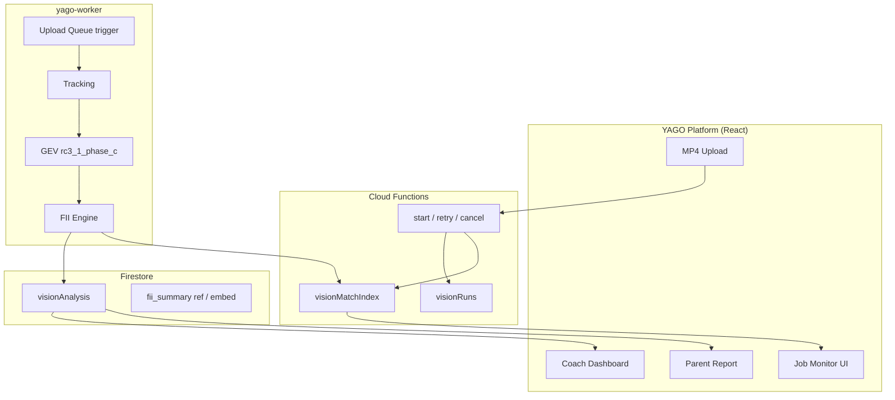

# YAGO Vision RC5 — Kick-off (Production Operations)

**Date:** 2026-06-30  
**Status:** 🚀 **KICK-OFF** — 운영 환경 구축 착수  
**Prior phase:** RC4 CLOSED 🔒 — `docs/YAGO_VISION_RC4_CLOSURE_REPORT.md`

---

## 1. RC5 목표

RC5는 **새로운 AI 알고리즘 개발이 아니다.**

RC3·RC4에서 LOCK한 분석 코어를 **실제 운영 환경(Firestore · 업로드 큐 · Job Monitor · 베타)** 에 안정적으로 연결하여, **실서비스에서 반복 사용 가능한 Production Operations** 를 완성하는 단계이다.

```text
기술 검증(RC1~RC4)  →  실서비스 운영(RC5)
```

| Prior RC | 역할 | RC5에서의 위치 |
|----------|------|----------------|
| RC1 | Detection / Tracking | Worker 실행층 (재사용 · LOCK) |
| RC2 | Reference GT · Validation | 회귀 기준 (LOCK) |
| RC3 | GEV Production · Report | **분석 코어 (LOCK · 소비)** |
| RC4 | Platform UI · E2E Demo | **UI·흐름 (LOCK · Firestore 우선 소비)** |
| **RC5** | Production Operations | **운영·실연동·베타** |

---

## 2. RC4 Handoff (LOCK 🔒)

RC5는 아래를 **변경하지 않고 운영(consumption + wiring)** 한다.

| 항목 | 값 |
|------|-----|
| Production Preset | `rc3_1_phase_c` |
| Pred dir | `gev_rc3_1_phase_c/` |
| Reference GT | 139 events (4 clips) — **events[] 수정 금지** |
| Baseline | `data/vision/gt/rc3_baseline_v2_1.json` |
| RC3 Snapshot | `data/vision/gt/rc3_metrics_snapshot.json` |
| RC4 Snapshot | `data/vision/gt/rc4_metrics_snapshot.json` |
| Closure Report | `docs/YAGO_VISION_RC4_CLOSURE_REPORT.md` |
| E2E Orchestrator | `scripts/vision/rc4_6_e2e_demo.py` |
| Pilot Match ID | `vision-pilot-pass01-clip-002` |
| UI Pilot Flag | `VITE_VISION_FII_PILOT=1` (fixture fallback) |

### RC4 완성 파이프라인

```text
영상 (MP4)
      │
      ▼
Tracking → GEV(rc3_1_phase_c) → FII → fii_summary.json
      │
      ├────────► Coach Dashboard
      ├────────► Parent Report
      ├────────► Match Timeline
      └────────► Platform UI (E2E Demo)
```

### RC4 한계 (RC5에서 해소)

| 항목 | RC4 상태 | RC5 목표 |
|------|----------|----------|
| Firestore 실데이터 | fixture fallback | **실경로 우선** |
| 업로드 → 자동 분석 | 수동 CLI / pilot | **Queue 자동화** |
| Job 진행 상태 | coarse status | **단계별 Monitor** |
| 실사용 검증 | 내부 데모 | **코치·학부모 VOC** |
| 베타 운영 | 없음 | **아카데미 시범** |

---

## 3. RC5 아키텍처 (목표)



### 레이어 정의

| Layer | RC5 책임 | 기존 코드 (시작점) |
|-------|----------|-------------------|
| L0 Upload | 실경기 MP4 · Storage · media doc | `TeamGrowthValidationPage`, `academyMediaIngestHelpers` |
| L1 Queue | job enqueue · idempotency · retry | `academyVisionAnalysisCallables`, `visionRuns` |
| L2 Status | match index · 단계별 progress | `visionMatchIndex`, `useMatchVisionPipelineStatus` |
| L3 Worker | m2 pipeline 고정 preset | `vision_engine_run.py --pipeline m2` |
| L4 Persist | visionAnalysis + FII bind | `academyVisionFirestore.ts` |
| L5 UI | Firestore 우선 · fixture fallback | `useCoachVisionAnalysis`, `useParentIntelligence` |

**설계 상세 (RC5-1):** `docs/YAGO_VISION_RC5_1_FIRESTORE_PIPELINE_DESIGN.md`

---

## 4. Firestore 연동 범위

### In scope (RC5)

| Path | 역할 |
|------|------|
| `teams/{teamId}/visionMatchIndex/{matchId}` | match ↔ media ↔ run ↔ analysis 인덱스 |
| `teams/{teamId}/media/{mediaId}/visionRuns/{runId}` | job 실행·상태·idempotency |
| `teams/{teamId}/matches/{matchId}/visionAnalysis/{analysisId}` | 분석 결과 SoT (Coach/Parent 소비) |
| Callable | `startVisionAnalysis` · `retryVisionAnalysis` · `cancelVisionAnalysis` |

### Out of scope (RC5 Kick-off)

| 항목 | 사유 |
|------|------|
| 신규 root Firestore collection | P0 Constitution |
| GT / GEV / FII 엔진 변경 | RC3·RC4 LOCK |
| 별도 Parent App | Persona Constitution |
| Stripe · Academy OS 확장 | Product Gate |

### Client read policy (현재)

- `visionMatchIndex` · `visionAnalysis`: staff/coach read (rules LOCK)
- Parent Report: translation layer + 허용된 match context (RC4 패턴 유지)

---

## 5. RC5 Gate

| Gate | ID | 목표 | PASS 조건 (예시) |
|------|-----|------|------------------|
| Firestore Production Pipeline | **RC5-1** | visionAnalysis 실저장 · match index | 업로드 1건 → Firestore → UI read E2E |
| Auto Upload Queue | **RC5-2** | MP4 → 자동 m2 pipeline | Queue enqueue · worker 완료 · index `completed` |
| Vision Job Monitor | **RC5-3** | 단계별 progress UI | Upload → Tracking → GEV → FII → Done 표시 |
| Coach/Parent Production | **RC5-4** | fixture 없이 실데이터 UI | Coach + Parent 화면 Firestore-only PASS |
| Academy Beta | **RC5-5** | 시범 운영 | 1 아카데미 · N경기 · 운영 매뉴얼 |
| **RC5 Closure** | — | Snapshot + Report | `phase: rc5_closed` |

```text
RC5-1 ──► RC5-2 ──► RC5-3 ──► RC5-4 ──► RC5-5 ──► Closure
```

---

## 6. 성공 기준

### RC5 CLOSED 🔒 판정

```text
□ RC3 Reference GT / rc3_1_phase_c 회귀 없음 (one-click report)
□ RC5-1 ~ RC5-5 Gate PASS
□ rc5_metrics_snapshot.json + RC5 Closure Report
□ Manifest phase: rc5_closed
□ Pilot fixture fallback 유지 (개발·회귀용)
```

### 운영 KPI (권장)

| Metric | Pilot 목표 | Production 목표 |
|--------|-----------|-----------------|
| Upload → analysis `completed` | 1 match E2E | p95 < 10 min |
| Firestore → UI reflect | < 30 s | < 10 s |
| Job failure recovery | manual retry PASS | auto-retry 1x |
| Coach/Parent VOC | 3+ sessions | beta cohort |

---

## 7. 운영 정책

### 7.1 Preset 고정

- Worker·CF 실행 시 GEV preset **`rc3_1_phase_c` only**
- env override는 **staging 전용** · production 배포 시 금지

### 7.2 Idempotency

- `idempotencyKey = teamId:mediaId:matchId`
- 동일 키로 `queued`/`processing` run 존재 시 **새 run 생성 금지**

### 7.3 실패 처리

| 상태 | 정책 |
|------|------|
| `failed` | `retryVisionAnalysis` 1회 권장 · 2회 실패 시 ops 알림 |
| `cancelled` | queued만 취소 · processing 중 cancel은 worker 협의 |
| partial artifact | visionAnalysis 미생성 · index `failed` 유지 |

### 7.4 Fallback

- `VITE_VISION_FII_PILOT=1` + fixture: **개발·데모·RC4 회귀 전용**
- Production 베타(RC5-5): fixture 없이 Firestore-only 경로 필수

---

## 8. 회귀 기준

배포·릴리스·RC5 마일스톤 완료 전:

```powershell
# GEV 회귀 (RC3 LOCK)
python scripts/report/vision_gev_gt_report.py --preset rc3_1_phase_c

# RC4 E2E 데모 (UI fixture)
python scripts/vision/rc4_6_e2e_demo.py --validate-only
```

| Check | 기대 |
|-------|------|
| Pooled Micro F1 | **0.7404** (deviation 없음) |
| Pooled FP / FN | **15 / 46** |
| RC4 E2E gates | 전부 `true` |

---

## 9. Rollback 정책

| 레벨 | 조건 | 조치 |
|------|------|------|
| L1 UI | Firestore read 장애 | `VITE_VISION_FII_PILOT=1` 활성화 · fixture fallback |
| L2 Worker | m2 pipeline 실패율 급증 | Queue pause · `rc3_1_phase_c` preset 확인 · hotfix branch |
| L3 GEV | 회귀 report FAIL | **RC5 작업 중단** · RC3 hotfix gate only |
| L4 Data | 잘못된 visionAnalysis | analysisId 무효화 · index `failed` · 재분석 |

**절대 rollback 대상 아님:** Reference GT events · Baseline · Report Layer 스크립트.

---

## 10. Scope

### ✅ In scope (RC5)

- Firestore production pipeline (RC5-1)
- Upload queue · worker trigger (RC5-2)
- Job Monitor UI — Upload / Tracking / GEV / FII / Done (RC5-3)
- Coach · Parent Firestore-only production path (RC5-4)
- Academy beta · VOC · 운영 매뉴얼 (RC5-5)
- firebase-admin / CF 안정화 (hang·timeout 해소)
- Latency·성공률 ops 메트릭

### ❌ Out of scope (RC5 Kick-off)

- GEV 알고리즘 튜닝
- Reference GT 수정
- Tracking 모델 재학습
- FII formula 변경
- 3D / Unity / realtime game
- Stripe · 별도 Parent App
- LLM Coach full product

### ⚠️ 조직 Gate 정렬

`.cursor/rules/yago-execution-order-lock.mdc` — K3 PASS 전 일부 UI는 설계·스펙만 허용될 수 있다. RC5 구현 시 Product Gate 충돌 시 **아키텍트 승인** 후 진행.

---

## 11. 일정 & 마일스톤 (권장)

| Milestone | Deliverable | Gate |
|-----------|-------------|------|
| **RC5-1** | Firestore Pipeline Design + wiring spec | RC5-1 |
| **RC5-2** | Auto Upload Queue | RC5-2 |
| **RC5-3** | Vision Job Monitor | RC5-3 |
| **RC5-4** | Coach/Parent Production | RC5-4 |
| **RC5-5** | Academy Beta + Run Sheet | RC5-5 |
| **RC5 Closure** | snapshot + closure report | RC5 CLOSED 🔒 |

---

## 12. RC5 Kick-off 선언

```text
RC5 Kick-off 🚀 (2026-06-30)

Prior: RC4 CLOSED 🔒
Production GEV: rc3_1_phase_c (LOCK)
Reference GT: 139 events (LOCK)

Focus: Firestore · Upload Queue · Job Monitor · Beta Operations
Not: GEV tuning · GT edit · new AI algorithms

Next: RC5-1 Firestore Production Pipeline (design → implement)
Design: docs/YAGO_VISION_RC5_1_FIRESTORE_PIPELINE_DESIGN.md
```

---

*YAGO Vision RC5 — Production Operations. Prior: `docs/YAGO_VISION_RC4_CLOSURE_REPORT.md`*
