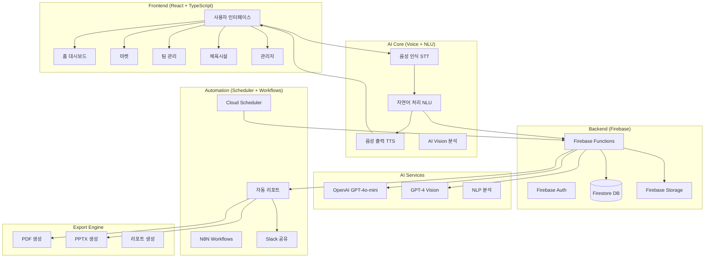

# YAGO VIBE SPT AI 아키텍처

## 전체 시스템 아키텍처



## Firebase Functions 구조

### 1. vibeReport
- **기능**: AI 리포트 생성
- **트리거**: HTTP / PubSub
- **출력**: JSON 리포트 데이터

### 2. vibeLog
- **기능**: 로그 저장
- **트리거**: HTTP POST
- **출력**: Firestore 로그 저장

### 3. vibeAutoPilot
- **기능**: 자동 인사이트 생성
- **트리거**: Firestore onCreate
- **출력**: AI 인사이트 + Slack 알림

### 4. slackShare
- **기능**: Slack 메시지 전송
- **트리거**: HTTP POST
- **출력**: Slack Webhook

### 5. generateIRSlides
- **기능**: IR 슬라이드 자동 생성
- **트리거**: HTTP POST
- **출력**: PPTX 파일 + Storage

### 6. exportReport
- **기능**: PDF/PPTX 리포트 내보내기
- **트리거**: HTTP POST
- **출력**: PDF/PPTX 파일 + Storage

## 데이터 플로우

```
사용자 명령
    ↓
STT (음성 인식)
    ↓
NLU (의도 분석)
    ↓
Firebase Functions
    ↓
Firestore 저장
    ↓
TTS (음성 응답)
    ↓
UI 업데이트
```

## 자동화 워크플로우

```
매일 오전 9시 (Cloud Scheduler)
    ↓
vibeAutoPilot 실행
    ↓
Firestore 통계 수집
    ↓
GPT-4o-mini 요약
    ↓
insights 컬렉션 저장
    ↓
Slack 알림 전송
    ↓
/admin/auto-insights 조회 가능
```

## IR 슬라이드 생성 프로세스

```
관리자 버튼 클릭
    ↓
generateIRSlides Functions
    ↓
통계 + AI 인사이트 수집
    ↓
GPT-4o-mini로 슬라이드 구성
    ↓
PPTX 생성 (4슬라이드)
    ↓
Firebase Storage 업로드
    ↓
Firestore reports 저장
    ↓
Slack 알림
```

## 주요 기능 모듈

### 1. 음성 기반 UI
- STT (Web Speech API)
- TTS (SpeechSynthesis)
- NLU (OpenAI GPT-4o-mini)

### 2. AI 마켓
- Vision API (이미지 분석)
- 자동 카테고리/태그 생성
- 실시간 채팅 (Firestore)

### 3. 팀 관리
- 이벤트 일정
- 멤버 관리
- 음성 검색

### 4. 체육시설
- Kakao 지도 연동
- 예약 시스템
- AI 추천

### 5. 자동 리포팅
- 일일 자동 리포트
- AI 인사이트 생성
- PDF/PPTX 자동 생성
- Slack 공유

## 기술 스택

### Frontend
- React + TypeScript
- Tailwind CSS
- Framer Motion (애니메이션)
- React Router DOM
- Lucide React (아이콘)

### Backend
- Firebase Auth
- Firestore (NoSQL)
- Firebase Storage
- Firebase Functions
- Firebase Admin SDK

### AI Services
- OpenAI GPT-4o-mini
- OpenAI Vision API
- Web Speech API

### Automation
- Cloud Scheduler
- N8N Workflows
- Slack Webhooks

### Export
- pdf-lib (PDF)
- pptxgenjs (PPTX)
- html-pdf

## 보안 고려사항

1. **환경 변수 관리**
   - `.env.local`에 API 키 저장
   - Firebase Functions Config 사용

2. **Firestore Security Rules**
   - 사용자별 접근 제어
   - Admin 전용 컬렉션

3. **CORS 설정**
   - Firebase Functions CORS 허용
   - API 요청 검증

## 배포 프로세스

```bash
# 1. 환경 변수 설정
firebase functions:config:set openai.key="sk-xxxxx"
firebase functions:config:set slack.webhook_url="https://hooks.slack.com/XXXX"

# 2. Functions 배포
firebase deploy --only functions

# 3. Frontend 빌드
npm run build

# 4. Firebase Hosting 배포
firebase deploy --only hosting
```

## 테스트 체크리스트

- [x] 음성 회원가입
- [x] 홈 대시보드
- [x] AI 마켓 + 채팅
- [x] 팀 관리 + 이벤트
- [x] 체육시설 지도 + 예약
- [x] 관리자 대시보드
- [x] AI 리포트 생성
- [x] 자동 인사이트 생성
- [x] IR 슬라이드 자동 생성
- [x] PDF/PPTX 내보내기
- [x] Slack 자동 공유

