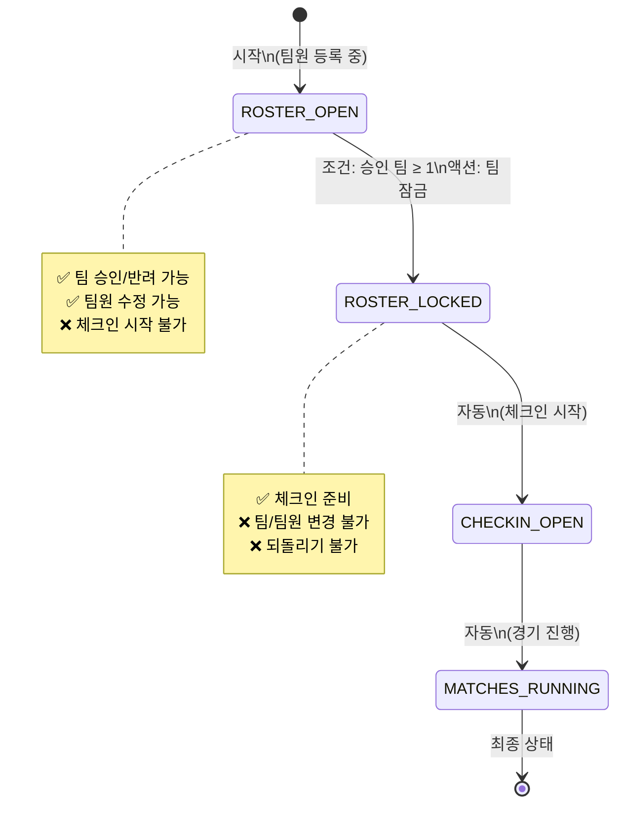

# 🔄 Tournament Phase FSM (상태 머신 다이어그램)

## 🎯 목적

- "지금 어디고, 다음은 어디인지"를 한 눈에
- 허용/불가 전이를 명확히 해서 실수 제거
- 서버 FSM / 운영 가이드 / UI 흐름을 완전히 일치

---

## 1️⃣ Phase FSM 전체 구조 (텍스트 다이어그램)

```
┌────────────────────┐
│    ROSTER_OPEN     │
│  (팀원 등록 중)     │
│                    │
│ 조건:              │
│ - 승인 팀 ≥ 1      │
└─────────┬──────────┘
          │
          │ Lock Roster
          │ (단방향)
          ▼
┌────────────────────┐
│   ROSTER_LOCKED    │
│ (팀원 명단 잠금)    │
│                    │
│ 의미:              │
│ - 팀 구성 고정     │
│ - 되돌릴 수 없음   │
└─────────┬──────────┘
          │
          │ Open Check-in
          │
          ▼
┌────────────────────┐
│   CHECKIN_OPEN     │
│   (체크인 시작)     │
│                    │
│ 의미:              │
│ - 행사/경기 시작   │
│ - 운영 단계 진입   │
└────────────────────┘
```

---

## 2️⃣ FSM 핵심 규칙 (절대 불변)

### ✅ 허용되는 전이

- `ROSTER_OPEN → ROSTER_LOCKED`
- `ROSTER_LOCKED → CHECKIN_OPEN`
- `CHECKIN_OPEN → MATCHES_RUNNING` (다른 함수에서 처리)

### ❌ 금지되는 전이

- `ROSTER_OPEN → CHECKIN_OPEN` (건너뛰기 불가)
- `CHECKIN_OPEN → ROSTER_LOCKED` (되돌리기 불가)
- 동일 phase 반복 전이 (서버는 성공으로 무시 — idempotent)

### 서버 구현 (ALLOWED_TRANSITIONS)

```typescript
const ALLOWED_TRANSITIONS = {
  "": ["ROSTER_OPEN"],                    // 초기 → 등록 시작
  "ROSTER_OPEN": ["ROSTER_LOCKED"],      // 등록 시작 → 잠금
  "ROSTER_LOCKED": ["CHECKIN_OPEN"],     // 잠금 → 체크인
  "CHECKIN_OPEN": ["MATCHES_RUNNING"],   // 체크인 → 경기 진행
  "MATCHES_RUNNING": [],                 // 최종 (전이 없음)
};
```

---

## 3️⃣ 서버 관점 FSM 규칙 요약 (개발자용)

### 핵심 원칙

1. **current phase는 DB 기준**
   - 클라에서 보내는 phase는 참고도 안 함
   - 항상 Firestore에서 현재 상태를 읽어서 검증

2. **조건 불충족 시**
   - `NO_APPROVED_TEAMS`: 승인 팀 0개
   - `INVALID_TRANSITION`: 허용되지 않은 전이

3. **동일 phase 요청**
   - `200 OK + alreadyInState: true`
   - Phase 추가 변경 없음

4. **모든 성공 전이는**
   - `phaseVersion +1`
   - `phaseEvents` 1건 생성

---

## 금지된 전이

### ❌ 불가능한 전이 예시

```
ROSTER_OPEN → MATCHES_RUNNING  (건너뛰기 불가)
ROSTER_LOCKED → ROSTER_OPEN    (되돌리기 불가)
MATCHES_RUNNING → CHECKIN_OPEN (역방향 불가)
```

### 에러 코드
- `INVALID_TRANSITION`: 허용되지 않은 전이 시도

---

## 상태별 속성

### ROSTER_OPEN
- `rosterOpen: true`
- `rosterLocked: false`
- 팀원 등록 가능

### ROSTER_LOCKED
- `rosterOpen: false`
- `rosterLocked: true`
- 팀원 등록 불가
- 대진표 생성 준비 완료

### CHECKIN_OPEN
- 체크인 진행 중

### MATCHES_RUNNING
- 경기 진행 중
- 최종 상태

---

## 동시성 제어

### 트랜잭션 기반
- 모든 Phase 전이는 Firestore Transaction 내에서 처리
- 동시 요청 시 하나만 성공, 나머지는 `alreadyInState: true`

### Version 기반
- `phaseVersion` 필드로 동시성 제어
- 단조 증가 (감소 불가)

---

## 멱등성

### requestId 기반
- 동일 `requestId`로 재요청 시 `replay: true` 반환
- Phase 추가 변경 없음

### 상태 기반
- 이미 해당 Phase인 경우 `alreadyInState: true` 반환
- Phase 추가 변경 없음

---

## 이벤트 로깅

### phaseEvents 컬렉션
모든 Phase 전이는 `phaseEvents` 서브컬렉션에 기록:

```typescript
{
  fromPhase: "ROSTER_OPEN",
  toPhase: "ROSTER_LOCKED",
  actorUid: "user-id",
  requestId: "uuid",
  createdAt: Timestamp,
  timestamp: number,
}
```

---

## 📈 시각화 도구

### Mermaid 다이어그램 (개발자·운영자 공용)



### ASCII 아트 (빠른 참조)

```
초기 ─→ [팀원 등록 중] ─→ [팀원 명단 잠금] ─→ [체크인 시작] ─→ [경기 진행]
        (ROSTER_OPEN)      (ROSTER_LOCKED)    (CHECKIN_OPEN)    (MATCHES_RUNNING)
        
        승인 팀 ≥ 1 필요    자동               자동              최종
        팀 잠금 처리        되돌리기 불가
```

---

## 5️⃣ 이 다이어그램의 효력

- ✅ **UI 설계 기준**: 허용된 전이만 버튼 표시
- ✅ **서버 FSM 기준**: `isTransitionAllowed()` 함수
- ✅ **운영 가이드 기준**: 관리자 가이드 문서
- ✅ **장애 분석 기준**: 이상 징후 감지

### 👉 이 다이어그램과 다른 동작은 모두 버그다.

---

## 📍 구현 코드 위치

- **FSM 정의**: `functions/src/tournament/updateTournamentPhase.ts`
- **전이 검증**: `isTransitionAllowed()` 함수
- **트랜잭션 처리**: `db.runTransaction()` 내부

---

## 📚 관련 문서

- `OPERATIONS_ADMIN_GUIDE.md`: 운영 가이드
- `MONITORING_ALERTS.md`: 모니터링 & 알람
- `ROLLBACK_SCENARIO.md`: 비상 롤백 시나리오
